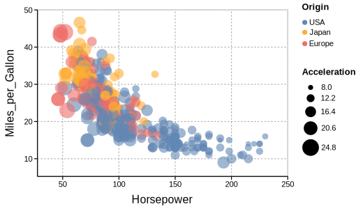
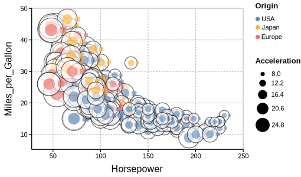
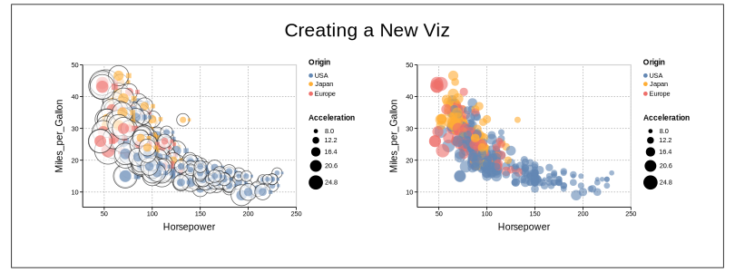

# Vizagrams.jl <a href='#'></a>
[](https://davibarreira.github.io/Vizagrams.jl/dev/)
[](https://github.com/davibarreira/Vizagrams.jl/actions/workflows/CI.yml?query=branch%3Amaster)
[](https://codecov.io/gh/davibarreira/Vizagrams.jl)
[](https://github.com/invenia/BlueStyle)
[](https://github.com/JuliaTesting/Aqua.jl)
[](https://github.com/aviatesk/JET.jl)
[](https://doi.org/10.5281/zenodo.12772755)


Vizagrams is a visualization framework that integrates
**diagramming** and **data visualization**, with the goal
of providing high expressiveness with intuitive usability.

The framework implements a diagramming DSL together
with a visualization grammar, thus allowing users to
create diagrams by combining and transforming plots,
as well as to create new visualization specifications using diagram construction
operations.

-----
## :page_with_curl: Why another visualization package?

The moto for Vizagrams is "high expressiveness with intuitive usability."
In other words, the goal is for users to be able to produce (complex) visualizations without having to become
power-users or resorting to ad-hoc methods, where the complexity is hidden by several
lines of code.
To achieve this, Vizagrams uses a novel approach to data visualization construction,
which integrates graphic specification and diagramming.

The framework implements a *diagramming DSL*, and builds a *visualization grammar* on top of it.
The idea of constructing data visualization tools on top of diagramming frameworks is not new[^1].
What makes Vizagrams distinct is how it uses the concepts of
*graphical marks* and *graphic expressions*[^2] to
blur the distinction between data visualization and diagramming.
This allows users to produce plots and manipulate
them using diagramming operations such as composition, translation, rotation, style transformations,
and so on.

One of the core assumptions of Vizagrams is that once users understand the basics of the framework,
the task of creating new visualizations becomes similar to diagramming, hence the "intuitive usability."
In terms of "expressiveness," we let the gallery of examples speak for itself.

## Package Features

Here is a summary of the features provided by Vizagrams:

* Diagramming DSL inspired by the Haskell library [Diagrams](https://archives.haskell.org/projects.haskell.org/diagrams/);
* Visualization grammar with syntax similar to [Vega-Lite](https://vega.github.io/vega-lite/);
* Ability to define custom graphical marks;
* Use graphic expressions to create new data visualization specifications;
* Manipulate and combine plots using diagramming operations;

## Quickstart

Let us do some simple examples to illustrate how to use Vizagrams. We start with a simple diagram:
```julia
using Vizagrams

d = Circle() + T(2,0)*Square()
draw(d)
```


Note that `+` represents composition, and `T(2,0)` is translation. Besides translations,
we have rotation (`R(ang)`), uniform scaling (`U(x)`), mirror reflection (`M(ang)`),  and stylistic transformations (`S(...)`).
Let us increment our previous diagram:

```julia
d = S(:fill=>:white,:stroke=>:black)*Circle(r=2) + d
draw(d)
```


For plotting, we use the visualization grammar syntax. If you have used [VegaLite.jl](https://github.com/queryverse/VegaLite.jl),
this might look familiar:

```julia
using DataFrames
using VegaDatasets
df = DataFrame(dataset("cars"));
df = dropmissing(df);

plt = Plot(
    data=df,
    encodings=(
        x=(field=:Horsepower,),
        y=(field=:Miles_per_Gallon,),
        color=(field=:Origin,)
    ),
    graphic=Circle(r=5)
)
draw(plt)
```


We can use our diagram `d` as a mark for a new plot:
```julia
new_plt = Plot(
    data=df,
    encodings=(
        x=(field=:Horsepower,),
        y=(field=:Miles_per_Gallon,),
        color=(field=:Origin,),
        size=(field=:Acceleration,),
    ),
    graphic = Mark(d)
)

draw(new_plt)
```


We can manipulate our plots and add new diagram elements in order to produce new visualizations:
```julia
viz_title = TextMark(text="Creating a New Viz",anchor=:c,fontsize=20)
viz_frame = S(:fillOpacity=>0,:stroke=>:black)T(400,100)*Rectangle(h=370,w=1000)

new_viz = new_plt + T(470,0)plt + viz_frame + T(400,250)*viz_title

draw(new_viz)
```


Check the documentation for a more thorough exposition.

## Installation

To install Vizgrams.jl, run the following command in the Julia REPL:
```julia
julia>]
pkg> add Vizagrams
```

## Related Packages in the Julia Ecosystem

* **Compose.jl** - A vector graphics library for Julia, that can be used for diagram drawing. Similar to Vizagrams, it is also inspired by the Haskell library Diagrams.
* **Gadfly.jl** - A data visualization package based largely on Hadley Wickhams's `ggplot2`. It has been developed for many years, thus, it is a good choice for those who want a robust data visualization package with a visualization grammar implementation.
* **Luxor.jl** - Package for drawing simple static 2D vector graphics. The focus of Luxor is on simplicity and ease of use.
* **Thebes.jl** - A little extension package for the package Luxor.jl that provides some rudimentary 3D (2.5D?) wireframe functionality.
* **Javis.jl** - A tool focused on providing an easy to use interface for making animations and developing visualizations quickly.
* **Makie.jl** - Implements an interactive plotting ecosystem. Similar to Python's Matplotlib, it does not implement a visualization grammar, instead, users can pick from a collection of charts and arrange them using layouts and other customization options.
* **AlgebraOfGraphics.jl** - Defines an algebra of graphics where plot specifications are constructed by combining layers using `+` and `*` operations. Visualizations are powered by Makie.
* **Plots.jl** - A visualization interface and toolset. It does not implement a visualization grammar, instead relying on the concept of plot attributes as the building block of plot specifications.
* **VegaLite.jl** - Plotting package based on [Vega-Lite](https://vega.github.io/vega-lite/), which is a high-level grammar of interactive graphics.

```
[^1]: For example, [Gadfly.jl](http://gadflyjl.org/stable/) is built on top of [Compose.jl](https://giovineitalia.github.io/Compose.jl/latest/)
and the R pacakge [ggplot2](https://ggplot2.tidyverse.org) is built on top of [grid](https://cran.r-project.org/web/packages/grid/index.html).
[^2]: Check the documentation for an explanation on graphical marks and graphic expressions.
